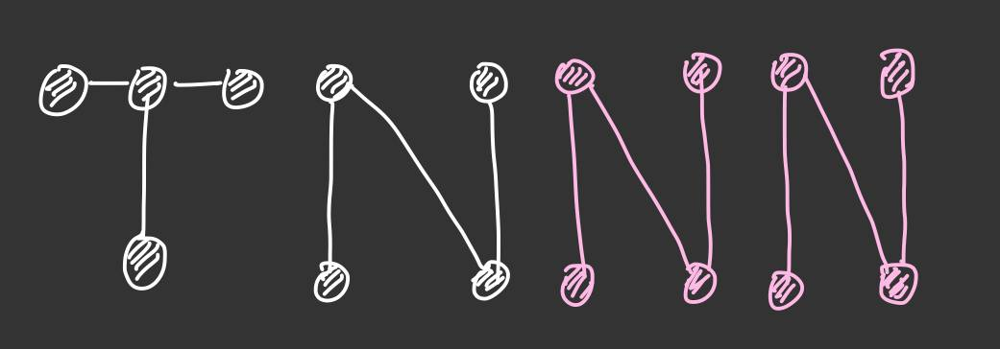

# TNNN


## Folder Tree (Current)
- TNML_2022
    - data
    - history
        - model_arch
            - timestamp
                - acc
                - loss
                - val_acc
                - val_loss
    - img
    - model_weight
        - model_arch
            - timestamp
                - model_weight
    - **src**
        - relic
        - **util**
            - save_history.py
            - save_load_model.py
            - timestamp.py
        - model.py (to be divided by multiple parts)
        - ~~mpo.py~~ main.py
        - init_model.py
        - resize.py (to be move to util)
        - save_dataset.y (to be move to util)

## Instruction
- Run model silently: 
```bash
# (depreciated)
#nohup python3 ./src/{model}.py model_architecture nepoch bond_dim nnode dataset &
# Should type:
nohup python3 ./src/main.py model_architecture nepoch bond_dim nnode dataset &
```

## Some tips

- Using `tmux` in wsl-2 can divided window into multiple panes
- pdfcrop --margin 5  {source}.pdf {output}.pdf
- hdf5 viewer
- git 
    - git status
    - git log
    - git add .
    - git commit -m "message"


## TODO
- dimension check (write warning message and exit)
    - 2022/07/19: partially done (see tnlenet5)
- md2pdf cannot convert latex

## DONE

:ballot_box_with_check:Suppress Numa Node INFO (2022/07/25)

